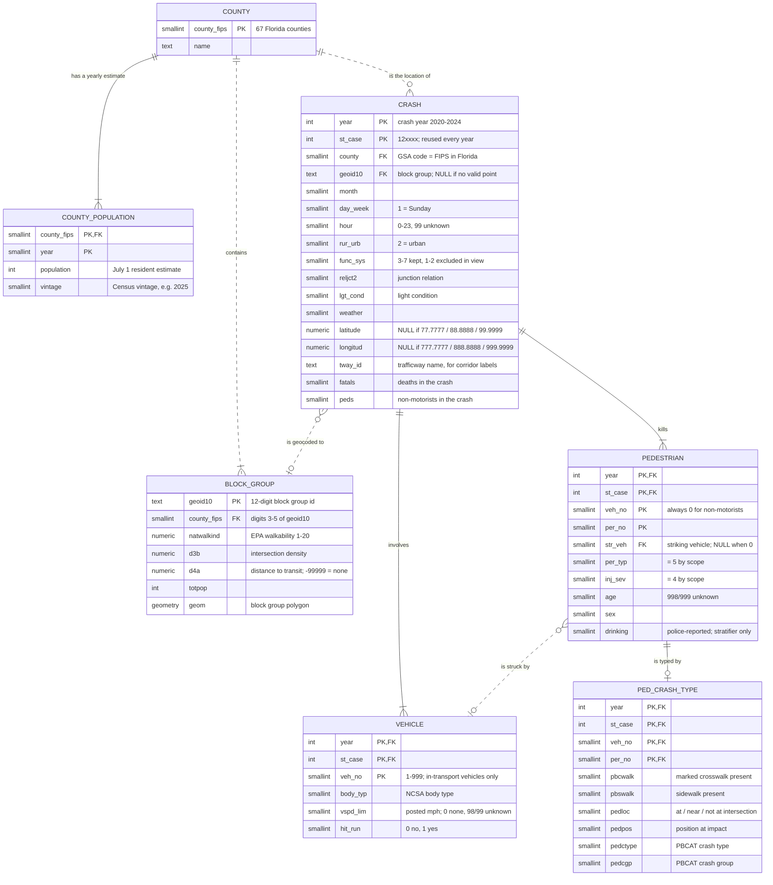

# Built for Cars, Deadly for Walkers

**Mining the roadway conditions behind Florida's pedestrian deaths, 2020–2024**

Yelysei Shkirpan · Capstone Project, B.S. Data Science · Eastern Florida State College · Fall 2026

This repository will hold the capstone deliverables: the PostgreSQL database and data dictionary, the validated ETL pipeline, the analysis notebooks, and the dashboard. Right now it holds the **Week 4 activity: a first-pass conceptual data model** for the approved project question. The physical schema (the graded schema document) will be built from this model after peer review.

**Central question (from the approved proposal):** *Which combinations of roadway class, posted speed limit, lighting, crossing location, and time of day most frequently characterize fatal pedestrian crashes on Florida's urban roads from 2020 through 2024, and which counties concentrate the most deaths under each pattern?*

**Audience:** safety planners at FDOT's State Safety Office and Florida MPOs who decide which FHWA proven countermeasures (lighting, crossings, medians, speed management) and which counties and corridor types to fund first.

## Contents of this submission

1. [Unit of observation](#1-unit-of-observation)
2. [ER diagram](#2-er-diagram) — entities, keys, attributes, relationships, cardinality, optionality
3. [Business rules the diagram must preserve](#3-business-rules-the-diagram-must-preserve)
4. [Test records: three representative, two edge cases](#4-test-records)
5. [Rationale](#5-rationale)
6. [Questions for peer reviewers](#6-questions-for-peer-reviewers)

Supporting files: `docs/erd.mmd` (diagram source), `docs/erd.svg` and `docs/erd.png` (static copies), `samples/*.csv` (the test records), `tests/check_samples.py` (checks the business rules against the records), `docs/Week4_Conceptual_Data_Model_Shkirpan.pdf` (this page as a PDF).

---

## 1. Unit of observation

**One pedestrian fatality: a FARS person record coded as a pedestrian (PER_TYP = 5) with a fatal injury (INJ_SEV = 4) in a Florida crash from 2020 through 2024, linked to the crash it happened in, the vehicle that struck it, the county it happened in, and, when the coordinates are valid, the census block group around it.**

So the unit is the person, not the crash. A crash that kills two pedestrians produces two observations that share the same scene. The urban, non-freeway subset from the proposal (RUR_URB = 2, FUNC_SYS 3–7) is a filter on this unit, applied in the analysis view, not a different unit. County fatality rates are aggregates of it.

## 2. ER diagram

Crow's foot notation. The source is `docs/erd.mmd` (Mermaid); GitHub renders it below. Static copies: [`docs/erd.svg`](docs/erd.svg), [`docs/erd.png`](docs/erd.png).



**How to read the symbols.** `||` exactly one · `|o` zero or one · `}|` one or more · `}o` zero or more. The symbol next to an entity says how many of *that* entity take part for one instance of the other. A solid line is an identifying relationship: the child's key contains the parent's key. A dashed line is a non-identifying relationship: a plain foreign key. `PK` = part of the primary key, `FK` = foreign key.

### Entities

| Entity | One row is… | Source | Identifier | Attributes kept in scope, and why |
|---|---|---|---|---|
| **CRASH** | one fatal crash in Florida, 2020–2024, with at least one pedestrian death | FARS *accident* file, STATE = 12 | `year` + `st_case` | `county`, `month`, `day_week`, `hour` (when and where); `rur_urb`, `func_sys`, `reljct2`, `lgt_cond`, `weather` (the scene conditions in the question); `latitude`, `longitud`, `geoid10` (the point, for the spatial join); `tway_id` (corridor label for the dashboard); `fatals`, `peds` (reconciliation counts) |
| **VEHICLE** | one motor vehicle in transport in that crash | FARS *vehicle* file | `year` + `st_case` + `veh_no` | `vspd_lim` (FARS records the posted speed limit per vehicle, for the road that vehicle was on), `body_typ`, `hit_run` |
| **PEDESTRIAN** | one person killed while walking (PER_TYP = 5, INJ_SEV = 4) — the unit of observation | FARS *person* file | `year` + `st_case` + `veh_no` (always 0) + `per_no` | `str_veh` (link to the striking vehicle), `age`, `sex`, `drinking` (stratifier only, never a rule antecedent); `per_typ`, `inj_sev` kept as scope checks |
| **PED_CRASH_TYPE** | the PBCAT crash-typing record for one pedestrian | FARS *pbtype* file | the same four columns as PEDESTRIAN | `pbcwalk`, `pbswalk`, `pedloc`, `pedpos`, `pedctype`, `pedcgp` (crossing location and what the pedestrian was doing) |
| **COUNTY** | one of Florida's 67 counties | Census FIPS; FARS county codes equal FIPS in Florida | `county_fips` | `name` |
| **COUNTY_POPULATION** | one July 1 resident estimate for one county in one year | Census Vintage 2025 estimates | `county_fips` + `year` | `population` (rate denominator), `vintage` (which Census release the number came from) |
| **BLOCK_GROUP** | one census block group with its walkability score | EPA Smart Location Database v3 / National Walkability Index | `geoid10` | `county_fips`, `natwalkind`, `d3b`, `d4a`, `totpop`, `geom` |

### Relationships

| Relationship | Read left to right | Read right to left | Line | Why it is shaped this way |
|---|---|---|---|---|
| COUNTY — COUNTY_POPULATION | a county has one or more yearly estimates | an estimate belongs to exactly one county | identifying | rates need one denominator per county and year; normalized, so a new vintage or a sixth year adds rows, not columns |
| COUNTY — CRASH | a county is the location of zero or more crashes | a crash happened in exactly one county | non-identifying | mandatory: every death must land in a county rate; a county with zero deaths still exists (rate 0, unstable flag) |
| COUNTY — BLOCK_GROUP | a county contains one or more block groups | a block group lies in exactly one county | non-identifying | lets walkability be aggregated to the county when a crash cannot be geocoded |
| CRASH — BLOCK_GROUP | a crash is geocoded to zero or one block group | a block group contains zero or more crash points | non-identifying | optional because coordinates are sometimes missing; the link is derived by a spatial join, it is not in FARS |
| CRASH — PEDESTRIAN | a crash kills one or more pedestrians | a pedestrian died in exactly one crash | identifying | only crashes with a pedestrian death are loaded, hence "one or more" |
| CRASH — VEHICLE | a crash involves one or more in-transport vehicles | a vehicle belongs to exactly one crash | identifying | FARS only records crashes that involve at least one motor vehicle in transport |
| PEDESTRIAN — VEHICLE | a pedestrian is struck by zero or one vehicle | a vehicle strikes zero or more pedestrians | non-identifying | the FARS code list allows STR_VEH = 0 ("not applicable"), and FARS records only one striking vehicle per non-motorist |
| PEDESTRIAN — PED_CRASH_TYPE | a pedestrian is typed by zero or one crash-typing record | a typing record belongs to exactly one pedestrian | identifying | the manual defines one PBTYPE record per pedestrian; kept optional so a missing record is a validation warning, not a load failure |

### Left out on purpose

- `code_lookup` (variable, code, label, year_from, year_to). Every coded column points to it, so drawing it would add a line to every entity. It belongs to the physical schema and the data dictionary.
- `etl_log`, `validation_result`, and the download manifest. They describe the pipeline, not the deaths.
- Parked and working vehicles (the FARS *parkwork* file). Not loaded in the first pass; a pedestrian whose STR_VEH names such a vehicle gets an empty striking-vehicle link (rule 2).
- Drivers and passengers in the same crashes. See reviewer question 1.
- RACE and HISPANIC. Excluded by the proposal's ethics section.
- `v_ped_transactions`. A view, not an entity: one row per pedestrian after the urban, non-freeway filter, with every attribute discretized into items.

## 3. Business rules the diagram must preserve

**Rule 1 — Identity survives across years.** A crash is identified by `year` and `st_case` together, because FARS reuses case numbers every year (Florida cases are 12xxxx in every file). Every vehicle, pedestrian, and crash-typing record carries the same `year` and `st_case` as its crash, so a record can never attach to a crash from another year. In the diagram both columns are `PK, FK` in all three child entities, joined by solid identifying lines. Tested by R1 and R2, which share `st_case` 120417 in 2021 and 2023 and stay separate crashes.

**Rule 2 — A pedestrian has at most one striking vehicle, and it must be an in-transport vehicle of the same crash.** `str_veh` is either empty or equal to a `veh_no` that exists under the same `year` and `st_case`. STR_VEH = 0 ("not applicable") or a number with no matching in-transport vehicle leaves the link empty; the pedestrian row stays, and its vehicle-side items (speed limit, body type, hit-and-run) become "unknown" in the analysis view. A vehicle may strike zero, one, or several pedestrians. In the diagram: `|o` beside VEHICLE, `}o` beside PEDESTRIAN, dashed line. This refines the proposal's Objective 1 check from "every pedestrian links to a striking vehicle" to "every non-zero STR_VEH resolves to a vehicle in the same crash".

**Rule 3 — Place is known at two levels, one mandatory and one optional.** Every crash has exactly one county, and that county must be one of the 67 rows in COUNTY; the FARS codes 0, 997, 998, and 999 fail validation. A crash links to at most one block group, and only when its coordinates are valid (the codes 77.7777, 88.8888, 99.9999 and their longitude equivalents become NULL) and the point falls inside a Florida block group. A crash with no block group still counts in its county's rate. In the diagram: `||` beside COUNTY on the crash line, `|o` beside BLOCK_GROUP.

## 4. Test records

All five records are synthetic. They follow the real code lists (FARS Analytical User's Manual, the FARS/CRSS pedestrian crash-typing manual, EPA SLD, Census) so they look like real rows, but none is copied from FARS. This is on purpose: FARS describes real deaths, the proposal promises that person-level rows stay in the local database, and a public repository is not the place for them. Population and walkability values are placeholders in a realistic range; the real Vintage 2025 and EPA values are loaded in Week 6.

Each record is one pedestrian fatality with all of its related rows. The same rows are in `samples/*.csv`, and `tests/check_samples.py` checks the three business rules against them (output at the end of this section).

### R1 — The archetype: dark, unlit arterial, mid-block

Friday, 9 p.m., November. A principal arterial (US-192) posted 45 mph, dark and not lighted, away from any junction, no marked crosswalk and no sidewalk, in Brevard County. A pickup strikes a 47-year-old man crossing the road. This is the pattern the question expects to find most often, and every link in the model is present: crash → county, crash → block group, pedestrian → striking vehicle, pedestrian → crash type.

| Entity | Key | Values |
|---|---|---|
| CRASH | (2021, 120417) | county = 9, geoid10 = 120090651021, month = 11, day_week = 6, hour = 21, rur_urb = 2, func_sys = 3, reljct2 = 1, lgt_cond = 2, weather = 1, latitude = 28.0791, longitud = -80.6752, tway_id = US-192, fatals = 1, peds = 1 |
| VEHICLE | (2021, 120417, veh_no 1) | body_typ = 31, vspd_lim = 45, hit_run = 0 |
| PEDESTRIAN | (2021, 120417, 0, per_no 1) | str_veh = 1, per_typ = 5, inj_sev = 4, age = 47, sex = 1, drinking = 0 |
| PED_CRASH_TYPE | (2021, 120417, 0, per_no 1) | pbcwalk = 0, pbswalk = 0, pedloc = 3, pedpos = 3, pedctype = 760, pedcgp = 750 |
| COUNTY / COUNTY_POPULATION | county_fips 9 / (9, 2021) | name = Brevard; population 2021 = 616,000 (vintage 2025) |
| BLOCK_GROUP | geoid10 120090651021 | county_fips = 9, natwalkind = 7.17, d3b = 41.3, d4a = -99999, totpop = 1842 |

### R2 — Intersection, lighted, turning vehicle

Wednesday, 6 p.m., January. A minor arterial posted 35 mph, dark but lighted, at an intersection with a marked crosswalk and sidewalks, in Miami-Dade County. A sedan turning left strikes a 72-year-old woman in the crosswalk area. This calls for a different countermeasure family (crossing visibility, turn conflicts) and shows that crossing location lives on PED_CRASH_TYPE, lighting on CRASH, and speed on VEHICLE. It shares `st_case` 120417 with R1; only the year keeps them apart (rule 1).

| Entity | Key | Values |
|---|---|---|
| CRASH | (2023, 120417) | county = 86, geoid10 = 120860042001, month = 1, day_week = 4, hour = 18, rur_urb = 2, func_sys = 4, reljct2 = 2, lgt_cond = 3, weather = 1, latitude = 25.8012, longitud = -80.2401, tway_id = NW 27TH AVE, fatals = 1, peds = 1 |
| VEHICLE | (2023, 120417, veh_no 1) | body_typ = 4, vspd_lim = 35, hit_run = 0 |
| PEDESTRIAN | (2023, 120417, 0, per_no 1) | str_veh = 1, per_typ = 5, inj_sev = 4, age = 72, sex = 2, drinking = 0 |
| PED_CRASH_TYPE | (2023, 120417, 0, per_no 1) | pbcwalk = 1, pbswalk = 1, pedloc = 1, pedpos = 2, pedctype = 781, pedcgp = 790 |
| COUNTY / COUNTY_POPULATION | county_fips 86 / (86, 2023) | name = Miami-Dade; population 2023 = 2,720,000 (vintage 2025) |
| BLOCK_GROUP | geoid10 120860042001 | county_fips = 86, natwalkind = 14.83, d3b = 168.9, d4a = 412.5, totpop = 2105 |

### R3 — Walking along the road, no sidewalk

Tuesday, 5 a.m., March, rain. A major collector posted 30 mph, dark and not lighted, in Duval County. A compact SUV strikes a 34-year-old man walking on the paved shoulder, from behind. Covers the 400-series crash group and shows an unknown code kept as a value rather than dropped (`drinking` = 9, unknown).

| Entity | Key | Values |
|---|---|---|
| CRASH | (2022, 121088) | county = 31, geoid10 = 120310144022, month = 3, day_week = 3, hour = 5, rur_urb = 2, func_sys = 5, reljct2 = 1, lgt_cond = 2, weather = 2, latitude = 30.3312, longitud = -81.6560, tway_id = MONCRIEF RD, fatals = 1, peds = 1 |
| VEHICLE | (2022, 121088, veh_no 1) | body_typ = 14, vspd_lim = 30, hit_run = 0 |
| PEDESTRIAN | (2022, 121088, 0, per_no 1) | str_veh = 1, per_typ = 5, inj_sev = 4, age = 34, sex = 1, drinking = 9 |
| PED_CRASH_TYPE | (2022, 121088, 0, per_no 1) | pbcwalk = 0, pbswalk = 0, pedloc = 3, pedpos = 4, pedctype = 410, pedcgp = 400 |
| COUNTY / COUNTY_POPULATION | county_fips 31 / (31, 2022) | name = Duval; population 2022 = 1,016,000 (vintage 2025) |
| BLOCK_GROUP | geoid10 120310144022 | county_fips = 31, natwalkind = 5.50, d3b = 22.7, d4a = -99999, totpop = 1310 |

### E1 — Edge case: one crash, two deaths (2024 Annual Report File)

Saturday, 11 p.m., July. A lighted principal arterial (US-441) posted 45 mph, mid-block, in Orange County. A large SUV strikes two people crossing together; both die. Tests that CRASH is one-to-many with PEDESTRIAN, that one VEHICLE can strike two pedestrians, that one scene becomes two transactions, that the county count rises by two, and that `fatals` = `peds` = 2 is available for the reconciliation check. The year is 2024, so the row comes from the Annual Report File and may change in the Final file; the reload must replace it, not duplicate it, which the composite key guarantees.

| Entity | Key | Values |
|---|---|---|
| CRASH | (2024, 120078) | county = 95, geoid10 = 120950145032, month = 7, day_week = 7, hour = 23, rur_urb = 2, func_sys = 3, reljct2 = 1, lgt_cond = 3, weather = 1, latitude = 28.4912, longitud = -81.4005, tway_id = US-441, fatals = 2, peds = 2 |
| VEHICLE | (2024, 120078, veh_no 1) | body_typ = 15, vspd_lim = 45, hit_run = 0 |
| PEDESTRIAN | (2024, 120078, 0, per_no 1) | str_veh = 1, per_typ = 5, inj_sev = 4, age = 29, sex = 1, drinking = 1 |
| PEDESTRIAN | (2024, 120078, 0, per_no 2) | str_veh = 1, per_typ = 5, inj_sev = 4, age = 26, sex = 2, drinking = 8 |
| PED_CRASH_TYPE | (2024, 120078, 0, per_no 1) | pbcwalk = 0, pbswalk = 1, pedloc = 3, pedpos = 3, pedctype = 770, pedcgp = 750 |
| PED_CRASH_TYPE | (2024, 120078, 0, per_no 2) | pbcwalk = 0, pbswalk = 1, pedloc = 3, pedpos = 3, pedctype = 770, pedcgp = 750 |
| COUNTY / COUNTY_POPULATION | county_fips 95 / (95, 2024) | name = Orange; population 2024 = 1,500,000 (vintage 2025) |
| BLOCK_GROUP | geoid10 120950145032 | county_fips = 95, natwalkind = 10.67, d3b = 95.4, d4a = 780.0, totpop = 2960 |

### E2 — Edge case: hit-and-run with no coordinates

Sunday, 2 a.m., September. A principal arterial (SR-60) posted 40 mph, dark and not lighted, in Hillsborough County. The vehicle left the scene, so its body type is unknown (99), but the posted speed limit is known because the road is. Latitude and longitude were not reported (77.7777 / 777.7777), so they become NULL and there is no block group. Tests the optional side of CRASH — BLOCK_GROUP (the walkability item becomes "unknown" while the death still counts in the county rate), that `hit_run` = 1 and `body_typ` = 99 are kept as values, and that the striking-vehicle link survives even when almost nothing is known about the vehicle.

| Entity | Key | Values |
|---|---|---|
| CRASH | (2022, 121307) | county = 57, geoid10 = NULL, month = 9, day_week = 1, hour = 2, rur_urb = 2, func_sys = 3, reljct2 = 1, lgt_cond = 2, weather = 1, latitude = NULL, longitud = NULL, tway_id = SR-60, fatals = 1, peds = 1 |
| VEHICLE | (2022, 121307, veh_no 1) | body_typ = 99, vspd_lim = 40, hit_run = 1 |
| PEDESTRIAN | (2022, 121307, 0, per_no 1) | str_veh = 1, per_typ = 5, inj_sev = 4, age = 58, sex = 1, drinking = 1 |
| PED_CRASH_TYPE | (2022, 121307, 0, per_no 1) | pbcwalk = 0, pbswalk = 0, pedloc = 3, pedpos = 3, pedctype = 620, pedcgp = 600 |
| COUNTY / COUNTY_POPULATION | county_fips 57 / (57, 2022) | name = Hillsborough; population 2022 = 1,513,000 (vintage 2025) |
| BLOCK_GROUP | — | no row: coordinates not reported, so no spatial join |

### Running the check

```
$ python tests/check_samples.py
```

```
Identifiers
  PASS  crash: composite key is unique
  PASS  vehicle: composite key is unique
  PASS  pedestrian: composite key is unique
  PASS  ped_crash_type: composite key is unique
  note  st_case reused across years, distinct crashes only because year is in the key: {'120417': ['2021', '2023']}
Rule 1 - one crash, identified by year + st_case, for every dependent record
  PASS  every vehicle row belongs to an existing crash
  PASS  every pedestrian row belongs to an existing crash
  PASS  every ped_crash_type row belongs to an existing crash
  PASS  every ped_crash_type row belongs to an existing pedestrian
  PASS  at most one ped_crash_type row per pedestrian
Rule 2 - at most one striking vehicle, and it must be an in-transport vehicle of the same crash
  PASS  str_veh is empty/0 or points to a vehicle in the same crash
  PASS  pedestrian rows are non-motorists (veh_no 0) coded pedestrian (5) and fatal (4)
  PASS  every crash has at least one in-transport vehicle
  PASS  every crash has at least one pedestrian fatality
  note  crashes with more than one pedestrian fatality (each death is its own row/transaction): {('2024', '120078'): 2}
Rule 3 - county is mandatory and known; block group is optional and only with valid coordinates
  PASS  every crash has a county that exists in the county table
  PASS  a block group is present only with valid coordinates and exists in block_group
  PASS  every county has a population estimate for every year 2020-2024
  PASS  every block group belongs to an existing county and its geoid encodes that county
  note  crashes with no block group (kept; they still count in county rates): [('2022', '121307')]
  note  counties with zero sample crashes (allowed; rate = 0 with an unstable flag): ['67']
Unknown codes kept as values, not dropped
  note  vehicle ('2022', '121307', '1') body_typ=99
  note  pedestrian ('2022', '121088', '1') drinking=9
  note  pedestrian ('2024', '120078', '2') drinking=8
  note  block_group 120090651021 d4a=-99999 (no transit; treat as NULL)
  note  block_group 120310144022 d4a=-99999 (no transit; treat as NULL)

All rules hold for the five sample records.
```

`python tests/check_samples.py --negative` adds three broken rows in memory (a vehicle with no crash, a pedestrian whose `str_veh` points to a vehicle that does not exist, a crash with county 999) and shows each rule failing.

## 5. Rationale

The central question asks which combinations of road class, posted speed, lighting, crossing location, and time of day recur in fatal pedestrian crashes on Florida's urban roads, and which counties concentrate them. The model puts each of those items on the entity where FARS actually records it, so that all of them can be pulled onto one row per death for the association mining.

The unit is the pedestrian, not the crash. Deaths are what planners count, and one crash can kill two people under the same conditions. That is why PEDESTRIAN carries the fatality and CRASH stays a parent. Light condition, junction relation, road class, and hour describe the scene, so they live on CRASH. The posted speed limit is a property of the road the striking vehicle was on, and FARS records it per vehicle; the "is struck by" relationship is what lets each death borrow the speed limit, body type, and hit-and-run flag of the vehicle that hit it. Crosswalk presence, position, and crash type come from the PBTYPE file and answer the crossing-location part of the question.

The "where" needs two levels. COUNTY and COUNTY_POPULATION give the denominators for the five-year rates and the county dashboard. BLOCK_GROUP adds the EPA walkability score. County is mandatory because every county rate must include every death. Block group is optional because coordinates are sometimes missing, and dropping those deaths would bias the rates.

Composite keys (year plus st_case) exist because FARS reuses case numbers every year. Unknown codes stay as values instead of being dropped, since "speed limit unknown" is itself something a planner should see. Left out on purpose are the code lookup, ETL log, and validation tables from the proposal: they describe the pipeline, not the deaths.

*(290 words)*

## 6. Questions for peer reviewers

1. **How wide should PEDESTRIAN be?** Right now it holds only the people who died, about 3,700 rows. Loading every person in those crashes (mostly drivers) would let me attach driver age and impairment to each pattern later, but it roughly triples the person rows and adds attributes the question does not ask about. Would you keep the entity narrow, or widen it to a general PERSON now, while the schema is still cheap to change?

2. **Where should the crash → block group link live?** It comes from a spatial join I run, not from FARS. I show it as a nullable `geoid10` on CRASH. The proposal had a separate `crash_blockgroup` table instead. Would you rather see the separate table, which can record the join method, boundary vintage, and date, or is a nullable key plus a note in the data dictionary enough?

## Repository layout

```
README.md                      this document
docs/erd.mmd                   ER diagram source (Mermaid)
docs/erd.svg, docs/erd.png     static renderings of the diagram
docs/Week4_Conceptual_Data_Model_Shkirpan.pdf   this document as a PDF
samples/*.csv                  the five test records, one file per entity
samples/README.md              which rows belong to which record
tests/check_samples.py         checks the business rules against the samples
.gitignore                     keeps raw FARS/EPA/Census files and credentials out of the repository
```

## Sources for the code definitions

- National Highway Traffic Safety Administration. (2026). *Manuals for FARS: Analytical user's manual 1975–2024, FARS/CRSS 2024 coding and validation manual, and pedestrian bicyclist crash typing manual*. U.S. Department of Transportation. https://static.nhtsa.gov/nhtsa/downloads/FARS/Links%20for%20FARS%20Manuals.pdf
- National Highway Traffic Safety Administration. (2025). *2023 FARS/CRSS pedestrian bicyclist crash typing manual* (Report No. DOT HS 813 694). U.S. Department of Transportation. https://crashstats.nhtsa.dot.gov/Api/Public/ViewPublication/813694
- U.S. Environmental Protection Agency. (2021). *National Walkability Index: Methodology and user guide*. https://www.epa.gov/sites/default/files/2021-06/documents/national_walkability_index_methodology_and_user_guide_june2021.pdf
- U.S. Census Bureau. (2026). *County population totals and components of change: 2020–2025 (Vintage 2025)*. https://www.census.gov/data/tables/time-series/demo/popest/2020s-counties-total.html
